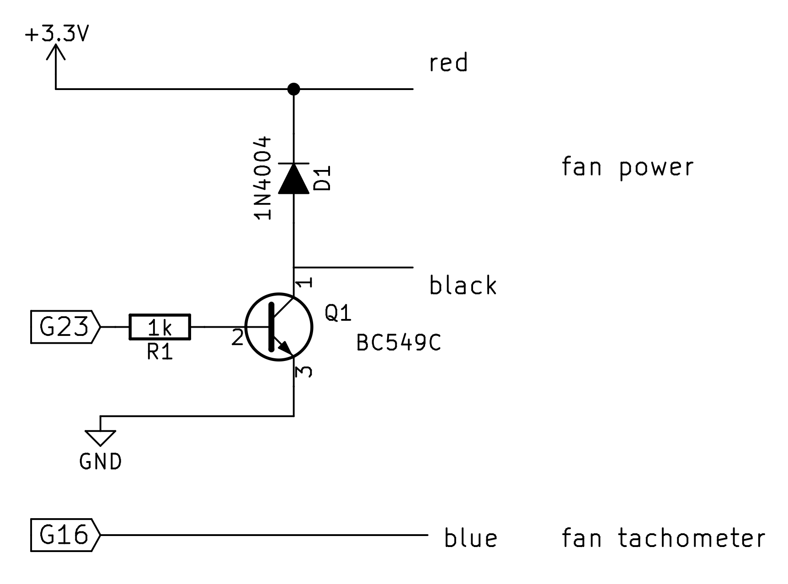

# homebridge-pwm-fan

PWM-based fan control and RPM tachometer, plugin for [Homebridge](https://github.com/nfarina/homebridge)

## Installation
1.	Install Homebridge using `npm install -g homebridge`
2.	Install this plugin `npm install -g homebridge-pwm-fan`
3.	Run `sudo pigpiod` after installing [the pigpio library](http://abyz.co.uk/rpi/pigpio/) and Python
4.	Update your configuration file - see below for an example

## Wiring diagram

More information: [How PC Fans Work](http://pcbheaven.com/wikipages/How_PC_Fans_Work/)

Example of a wiring diagram for a PC fan with three wires:



If there are four wires, wire the control wire to the PWM instead (leaving the fan power tied to the voltage rail) (untested).
If you only have two wires, PWM fan speed control is possible but there is no feedback, no tachometer to read RPM (TODO: make the tachometer optional)

Note that the tachometer may output voltage equal to the supply rail. To power the fan on higher voltages,
a logic level shifter would be needed to drop down the tachometer output to +3.3V suitable for Raspberry Pi GPIO input.


## Configuration
* `accessory`: "PWMFan"
* `name`: descriptive name
* `tach_bcm`: Broadcom pin number of tachometer
* `motor_bcm`: Broadcom pin number of motor control/power
* `frequency`: PWM frequency in hertz
* `def_dutycycle`: default dutycycle on startup (0-255 = 0-100%)
* `min_dutycycle`: minimum dutycycle, ignore attempts to set below (0-255 = 0-100%)

The given pin numbers should be the Broadcom (BCM) numbers, not physical.
Tachometer readings may be inaccurate on 3-wire fans, especially at higher frequencies or lower duty cycles
(fix is to use a 4-wire fan, with independent pulse-width control and fan power supply).

Example configuration:

```json
    "accessories": [
        {
            "accessory": "PWMFan",
            "name": "Desk Fan",
            "tach_bcm": 16,
            "motor_bcm": 23,
            "frequency": 1,
            "def_dutycycle": 255,
            "min_dutycycle": 0
        }
    ]
```

This creates a Fan service, with characteristics: On, and RotationSpeed (get/set).

## Implementation notes

Currently this plugin uses a Python helper script to access pigpiod, see `pwmfanhelper.py`
for reasons why and how this could be improved to use native Node.js modules in the future
(patches welcome!).

## License

MIT

